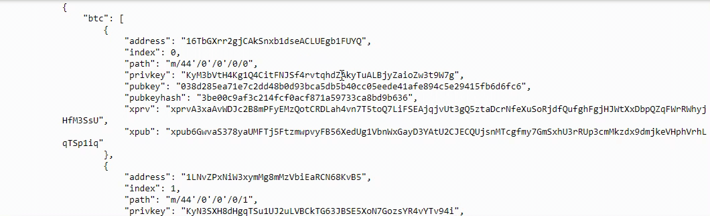

# Multi-Blockchain Wallet in Python

## Multiwallet - Step by Step Guide
---
#### Initial Requirements - New Startup

Main Focus of a newly startup company is to build a portfolio management system (PMS) that supports both, traditional assets (gold, silver, stocks, etc.) and currently very hot topic - crypto-assets!! But as there are many coins, our task is to understand how HD wallets work, and to build a system that can create them.

#### Race to capture the market

`hd-wallet-derive` - A command line tool that supports BIP32, BIP39 and BIP44 and also supports non-standard derivation paths for the most popular wallets. Unfortunately, there arent many tools available in `python` and we need to integrate the script in backend with `python`.

Once the integration is done with this "universal" wallet, one can manage billions of addresses across 300+ coins, giving a serious edge against the competition.

## Dependencies

- PHP must be installed on operating system (any version, 5 or 7). No need to know any PHP

- Clone the [`hd-wallet-derive`](https://github.com/dan-da/hd-wallet-derive) tool.

- [`bit`](https://ofek.github.io/bit/) Python Bitcoin library.

- [`web3.py`](https://github.com/ethereum/web3.py) Python Ethereum library.

## Instructions

    
Project setup

- Create a project directory called `wallet` and `cd` into it.

- Clone the `hd-wallet-derive` tool into this folder and install it using the instructions on its `README.md`.

- Create a symlink called `derive` for the `hd-wallet-derive/hd-wallet-derive.php` script into the top level project
  directory like so: `ln -s hd-wallet-derive/hd-wallet-derive.php derive`

  This will clean up the command needed to run the script in the code, to call `./derive`
  instead of `./hd-wallet-derive/hd-wallet-derive.php.exe`.

- Test run the `./derive` script properly, use one of the examples on the repo's `README.md`

  *Note*: If one gets an error running `./derive`, as it happens in Windows machine then use: `./hd-wallet-derive/hd-wallet-derive.php.exe`

- Create a file called `wallet.py` -- universal wallet script.

Directory tree for `hd-wallet-derive`

    

    
Setup constants

- In a separate file, `constants.py`, set the following constants:
  - `BTC = 'btc'`
  - `ETH = 'eth'`
  - `BTCTEST = 'btc-test'`

- In `wallet.py`, import all constants: `from constants import *`

- Use these anytime to reference these strings, both in function calls, and in setting object keys.

    
Generate a Mnemonic

- Generate a new 12 word mnemonic using `hd-wallet-derive` or by using [this tool](https://iancoleman.io/bip39/).

- Set this mnemonic as an environment variable, and include the one generated as a fallback using:
  `mnemonic = os.getenv('MNEMONIC', 'insert mnemonic here')`

    
Deriving the wallet keys

- Use the `subprocess` library to call the `./derive` script from Python. Make sure to properly wait for the process.

- The following flags must be passed into the shell command as variables:
  - Mnemonic (`--mnemonic`) must be set from an environment variable, or default to a test mnemonic
  - Coin (`--coin`)
  - Numderive (`--numderive`) to set number of child keys generated

- Set the `--format=json` flag, then parse the output into a JSON object using `json.loads(output)`

- Wrap all of this into one function, called `derive_wallets`

- Create an object called `coins` that derives `ETH` and `BTCTEST` wallets with this function.
  When done properly, the final object should look something like this (there are only 3 children each in this image):

Test the `coins` by calling `coins[COINTYPE][INDEX]['privkey']`.

    
Linking the transaction signing libraries

Use `bit` and `web3.py` to leverage the keys obtained in the `coins` object.
Create 3 more funtions:

1. `priv_key_to_account` -- this will convert the `privkey` string in a child key to an account object
  that `bit` or `web3.py` can use to transact.
  This function needs the following parameters:

  - `coin` -- the coin type (defined in `constants.py`).
  - `priv_key` -- the `privkey` string will be passed through here.

  Check the coin, then return one of the following functions based on the library:

  - For `ETH`, return `Account.privateKeyToAccount(priv_key)`
  - For `BTCTEST`, return `PrivateKeyTestnet(priv_key)`

2. `create_tx` -- this will create the raw, unsigned transaction that contains all metadata needed to transact.
  This function needs the following parameters:

  - `coin` -- the coin type (defined in `constants.py`).
  - `account` -- the account object from `priv_key_to_account`.
  - `to` -- the recipient address.
  - `amount` -- the amount of the coin to send.

  Check the coin, then return one of the following functions based on the library:

  - For `ETH`, return an object containing `to`, `from`, `value`, `gas`, `gasPrice`, `nonce`, and `chainID`.
    Make sure to calculate all of these values properly using `web3.py`!
  - For `BTCTEST`, return `PrivateKeyTestnet.prepare_transaction(account.address, [(to, amount, BTC)])`

3. `send_tx` -- this will call `create_tx`, sign the transaction, then send it to the designated network.
  This function needs the following parameters:

  - `coin` -- the coin type (defined in `constants.py`).
  - `account` -- the account object from `priv_key_to_account`.
  - `to` -- the recipient address.
  - `amount` -- the amount of the coin to send.

  Check the coin, then create a `raw_tx` object by calling `create_tx`. Then, sign
  the `raw_tx` using `bit` or `web3.py` (hint: the account objects have a sign transaction function within).

  Once signed the transaction, send it to the designated blockchain network.

  - For `ETH`, return `w3.eth.sendRawTransaction(signed.rawTransaction)`
  - For `BTCTEST`, return `NetworkAPI.broadcast_tx_testnet(signed)`
    

    
Execute the transactions

    
***Bitcoin Testnet transaction***

- Fund a `BTCTEST` address using [this testnet faucet](https://testnet-faucet.mempool.co/).

- Use a [block explorer](https://tbtc.bitaps.com/) to watch transactions on the address.

***BTCTEST Transaction***
    
    `btc_acc = priv_key_to_account(BTCTEST,btc_PrivateKey)`
    `create_tx(BTCTEST,btc_acc,"n3D8vVvLyD7pPQmWoQgMMERZrDjmBheBpU", 0.1)`
    `send_txn(BTCTEST,btc_acc,"mtK73sNPY9CKuzVvpv4W1969AD1UmGGfsX", 0.1)`

    Confirmation on executed transaction

***ETH Transaction - Local PoA***

- Add one of the `ETH` addresses to the pre-allocated accounts in `mtestnet.json`

- Initialize using `geth --datadir nodeX init mtestnet.json`.

- [Add the following middleware](https://web3py.readthedocs.io/en/stable/middleware.html#geth-style-proof-of-authority)
  to `web3.py` to support the PoA algorithm:

   `from web3.middleware import geth_poa_middleware
    w3.middleware_onion.inject(geth_poa_middleware, layer=0)`

- Connect to HTTP with address private key & check the balance of the account
    `w3 = Web3(Web3.HTTPProvider("http://127.0.0.1:8545/0x30c2577db89760baa9ba4058b1033b9e103f287e5de1689e35833ee8e7a7c857"))`
    `w3.eth.getBalance("0x46BbdBf56ff911A93AdaF0164d0709F78B52765E")`

- Due to a bug in `web3.py`, send a transaction or two with MyCrypto first, since the
  `w3.eth.generateGasPrice()` function does not work with an empty chain. Use one of the `ETH` address `privkey`,
  or one of the `node` keystore files.
    
- Send a transaction from the pre-funded address within the wallet to another, then get the `TxStatus` from MyCrypto
    `

